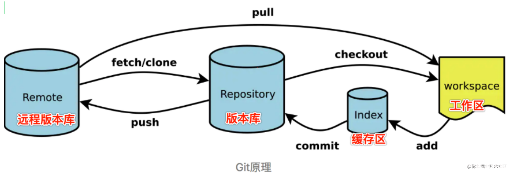

 本地版本



*   ⼯作区(Working Directory)、缓存区(Stage)、版本库(Repository)

```shell
# 查看git状态
git  status
git log
git log --oneline (常用简短日志)
git reflog（全部提交记录）

# 前进
git add ./ 
git commit -m ''

# 回退
git restore ./    # 工作区回退
git checkout ./   # 暂存区回退工作区
git reset HEAD^  # 仓库回退一个版本 仓库版本指针回退
git reset --hard HEAD^ （回退一个个版本常用）

# 暂存
git stash  存储
git stash pop  弹出

# 分支
git checkout -b 'new branch'  # 新建并切换分支
git checkout master  # 切换分支
git merge master # 合并分支
git merge --abort # 回退合并冲突
git branch --delete topic # 删除分支

git merge --squash newBranch # 合并分支，提交一次log记录

git branch -vv # 查看远程分支对应情况
git push -u <branch-name> <remote-name>


git branch -d localBranchName // 删除本地分支


git push origin --d remoteBranchName // 删除远程分支
git ls-remote //查看远程分支


# 标签
git tag -a v1.0.0 -m 'v1.0.0'
git push --tag 

# 删除tag
git tag -d v1.0.0
git push origin :v1.0.0
# 查看远程版本
git remote -v


```

 